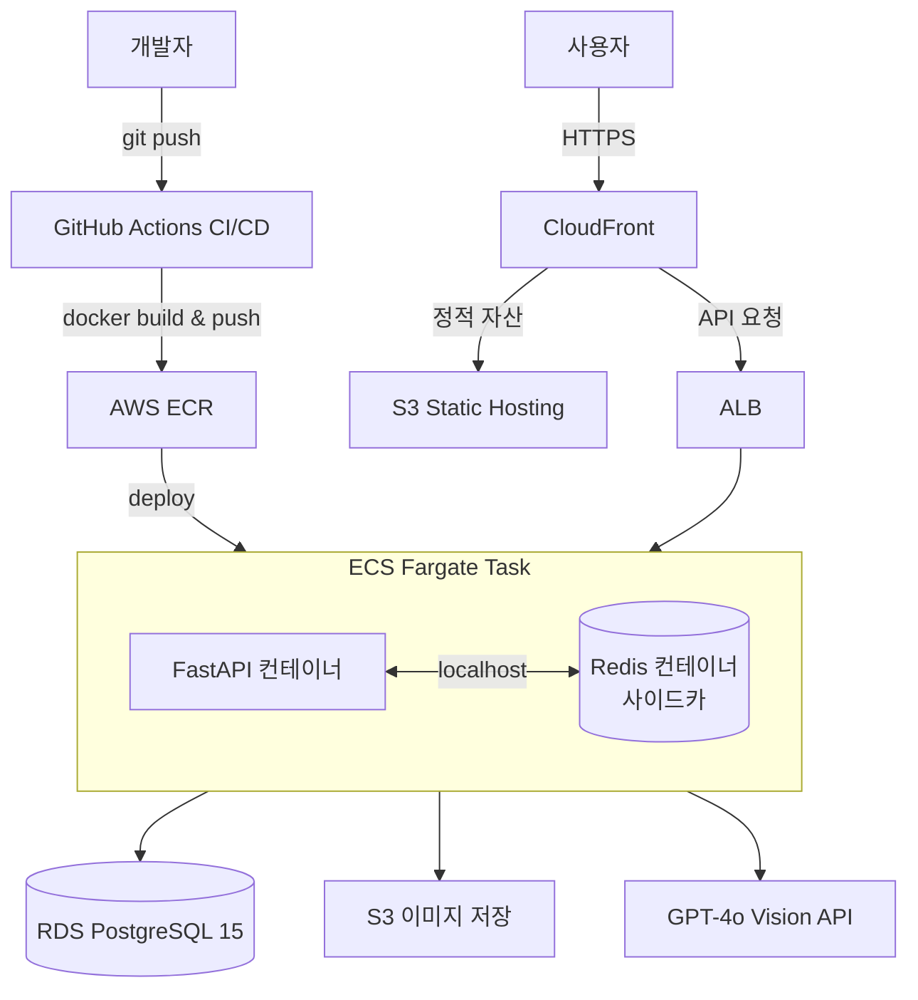

# 당마고치 (Dangmagochi)

> 당뇨 환자 및 위험군을 위한 라이프케어 + 다마고치 건강 캐릭터 서비스


---

## 서비스 소개

당마고치는 당뇨 환자 및 위험군을 위한 건강관리 앱입니다.  
ML 모델로 당뇨 위험도를 예측하고, 식단 이미지 분석과 생활습관 챌린지를 통해 건강한 라이프스타일을 만들어갑니다.  
달성할수록 함께 성장하는 다마고치 캐릭터가 동기부여를 도와줍니다.

| 기능             | 설명                                                        |
| ---------------- | ----------------------------------------------------------- |
| 당뇨 위험도 예측 | LightGBM 모델로 위험도 자동 분류 (normal / risk / diabetes) |
| 식단 이미지 분석 | GPT-4o Vision으로 음식 사진 분석 후 영양정보 제공           |
| 생활습관 챌린지  | 등급별 맞춤 챌린지 + AI 난이도 재설계 (Airflow)             |
| 다마고치 캐릭터  | 건강 상태 5축으로 캐릭터 감정 변화 + 레벨업 시스템          |

---

## 유저 등급 체계

```
normal   → goal: diet / maintain / fitness
risk     → risk_level: low / mid / high
diabetes → diabetes_type: 1type / 2type
```

| 등급       | 조건              | 세부타입                  | 주요 기능                           |
| ---------- | ----------------- | ------------------------- | ----------------------------------- |
| `normal`   | ML 예측 결과      | diet / maintain / fitness | 생활습관 챌린지, 식단 분석          |
| `risk`     | ML 예측 결과      | low / mid / high          | 위험도 추적, 탄수화물 집중 관리     |
| `diabetes` | 가입 시 직접 선택 | 1type / 2type             | 혈당 기록, 전문 챌린지, 인슐린 관리 |

> JWT 페이로드에 `user_type` + 세부타입 포함 → 매 요청마다 DB 조회 없이 등급 확인

---

## 기술 스택

| 분류                  | 기술                                                    |
| --------------------- | ------------------------------------------------------- |
| **Backend**           | FastAPI, SQLAlchemy, Alembic, python-jose, passlib      |
| **ML / AI**           | LightGBM, GPT-4o Vision, GPT-4o-mini, OpenAI API        |
| **Database**          | PostgreSQL 15, SQLAlchemy ORM                           |
| **Infrastructure**    | Docker, Docker Compose, GitHub Actions, AWS EC2, AWS S3 |
| **Frontend**          | React, Capacitor (iOS / Android)                        |
| **Monitoring**        | Sentry, Locust, Redis                                   |

---

## 아키텍처



---

## 프로젝트 구조

```
AI_02_04/
├── backend/
│   ├── app/
│   │   ├── core/           # config, database, deps
│   │   ├── models/         # SQLAlchemy 모델
│   │   ├── routers/        # API 엔드포인트
│   │   ├── schemas/        # Pydantic 스키마
│   │   ├── services/       # 비즈니스 로직
│   │   └── main.py
│   ├── migrations/         # Alembic 마이그레이션
│   ├── tests/
│   ├── Dockerfile
│   ├── docker-compose.yml
│   └── requirements.txt
├── frontend/
│   └── Dockerfile
├── ml/
│   ├── food_model/
│   └── risk_model/
└── README.md
```

---

## API 엔드포인트

### 인증 (Auth)

```
POST /auth/register    회원가입 + JWT 발급
POST /auth/login       로그인
POST /auth/refresh     토큰 갱신
POST /auth/logout      로그아웃
```

### 사용자 (Users)

```
GET  /users/me         프로필 조회
PUT  /users/me         프로필 수정 (체중 변경 시 BMI 자동 재계산)
PUT  /users/me/grade   등급 변경 + 토큰 재발급
```

### 건강 기록 (Health)

```
POST /health/records          건강 수치 기록 (물, 걸음수, 체중)
GET  /health/records          기록 목록 조회
POST /health/glucose          혈당 기록 (당뇨 전용)
GET  /health/glucose/history  혈당 이력 조회 (당뇨 전용)
```

### 챌린지 (Challenges)

```
GET  /challenges              챌린지 목록
POST /challenges/{id}/log     챌린지 달성 기록
GET  /challenges/my           오늘 달성 현황
GET  /challenges/streak       연속 달성 현황
```

### 포인트 / 식단 / 캐릭터

```
GET  /points                  포인트 조회
GET  /points/history          포인트 이력
POST /diet/analyze            식단 이미지 분석
GET  /diet/history            식단 기록 조회
GET  /character               캐릭터 상태 조회
GET  /character/collection    졸업 캐릭터 컬렉션
GET  /report/weekly           주간 리포트
```

> 📌 `POST /predict`, `POST /food/analyze`, `POST /recommendations` 는 ML 팀 담당

---

## ML 모델

### 당뇨 위험도 예측

- **모델**: LightGBM 이진 분류
- **데이터셋**: Diabetes Health Indicators (BRFSS2015)
- **성능**: AUC 0.82 / Recall 0.90
- **Threshold**: 0.35 미만 → normal / 0.35~0.50 → low / 0.50~0.70 → mid / 0.70↑ → high

### 식단 이미지 분류

- **모델**: GPT-4o Vision
- **출력**: 음식명, 칼로리, 탄수화물, 단백질, 혈당지수, 식단점수

---

## 로컬 개발 환경 세팅

### 1. 레포 클론

```bash
git clone https://github.com/AI-HealthCare-02/AI_02_04.git
cd AI_02_04
```

### 2. 환경변수 설정

```bash
cp backend/.env.example backend/.env
# .env 파일 열어서 값 채우기
```

### 3. 패키지 설치 (로컬 개발용)

```bash
cd backend

# Mac
uv venv .venv --python 3.11
source .venv/bin/activate
uv pip install -r requirements.txt

# Windows
python -m venv .venv
.venv\Scripts\activate
pip install -r requirements.txt
```

### 4. Docker 실행

```bash
docker-compose up --build
```

### 5. DB 마이그레이션

```bash
alembic upgrade head
```

### 6. 서버 확인

```
http://localhost:8000/health  → 헬스체크
http://localhost:8000/docs    → Swagger UI
```

---

## 성능 개선

| 항목 | 개선 전 | 개선 후 | 개선율 |
| ---- | ------- | ------- | ------ |
| `/dashboard` 응답시간 (Redis 캐싱) | 840ms | 190ms | **77% 개선** |

### Locust 부하테스트 결과

- **동시 접속**: 50명
- **총 처리**: 8,630건
- **Median**: 59ms / **95%ile**: 140ms

---

## 트러블슈팅

### ECS에서 `ml/risk_model` 경로 찾지 못하는 문제

- **원인**: Dockerfile 빌드 컨텍스트가 `backend/`로 지정되어 상위의 `ml/` 디렉토리에 접근 불가
- **해결**: 빌드 컨텍스트를 프로젝트 루트(`.`)로 변경하고 Dockerfile 내 `COPY` 경로 수정

### M1 Mac 로컬 빌드 이미지가 ECS에서 실행 안 되는 문제

- **원인**: M1 Mac 기본 빌드 아키텍처(`arm64`)와 ECS Fargate 실행 환경(`amd64`) 불일치
- **해결**: `docker buildx build --platform linux/amd64` 로 명시적 플랫폼 지정

### Alembic Enum 타입 변경이 감지되지 않는 문제

- **원인**: Alembic `autogenerate`가 PostgreSQL Enum 타입 변경을 추적하지 못함
- **해결**: `upgrade()` 내에 `ALTER TYPE ... ADD VALUE` SQL 수동 작성

### CloudFront에서 POST 요청 차단되는 문제

- **원인**: CloudFront 기본 동작이 GET/HEAD 외 메서드를 캐시 레이어에서 차단
- **해결**: API 전용 서브도메인 `api.dangmagoapp.shop` 을 ALB에 직접 연결하여 분리

---

## 브랜치 전략

```
main
└── develop
    └── feat/{이름}-{작업}   (예: feat/ytk-auth-api)
```

| 브랜치               | 설명             |
| -------------------- | ---------------- |
| `main`               | 프로덕션 배포    |
| `develop`            | 개발 통합 브랜치 |
| `feat/{이름}-{작업}` | 기능 개발 브랜치 |

---

## 팀 구성

| 이름   | 역할                                          |
| ------ | --------------------------------------------- |
| 윤태균 | 백엔드 / 인프라 (FastAPI, Docker, AWS, CI/CD) |
| 이재현 | 데이터 / ERD                                  |
| 정현희 | 프론트엔드 / React                            |
| 박형준 | ML / LLM 모델                                 |

---

## 라이선스

본 프로젝트는 부트캠프 교육 목적으로 제작되었습니다.

---

<p align="center">2026 당마고치 팀 · AI-HealthCare-02 · 38일 부트캠프 프로젝트</p>
